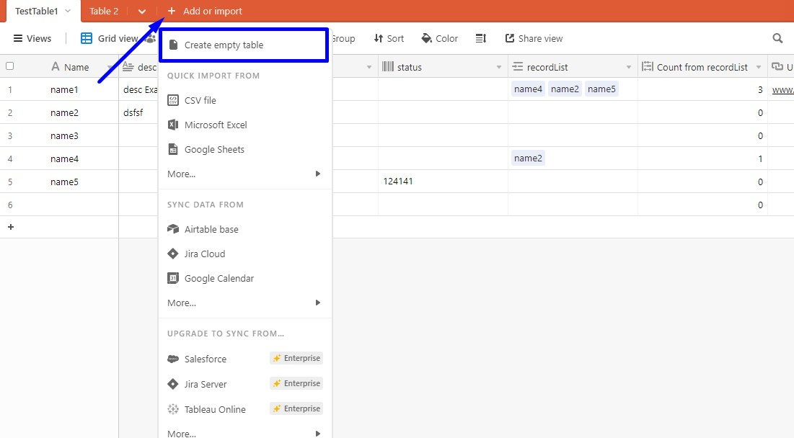
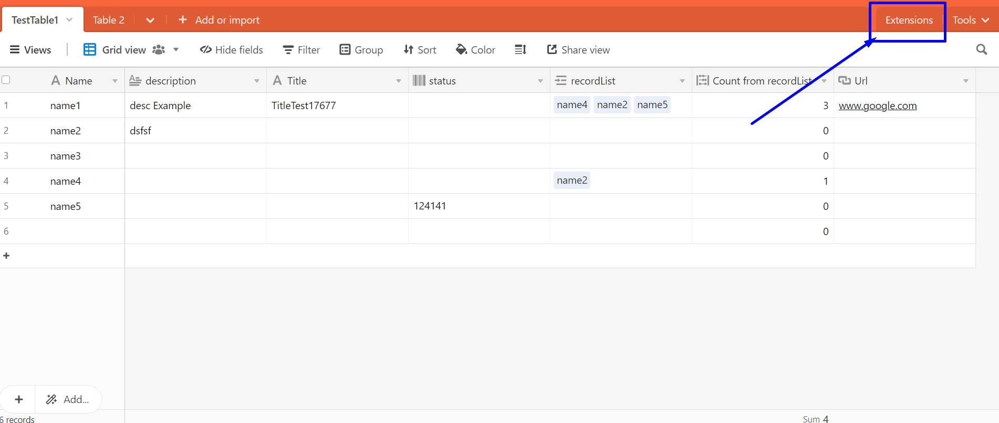
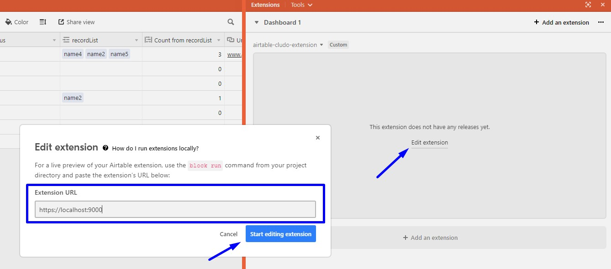

# airtable-cludo-extension

[Configurator](https://customer.cludo.com/)

[Confluence](https://cludosearch.atlassian.net)

Airtable Cludo is an extension built on [Airtable Blocks framework](https://www.airtable.com/developers) that integrates with Airtable web application and facilitates data pushing from tables (in Airtable UI) directly to an index. This is a tool intended for internal use for now.

## Getting Started

### Prerequisites

Start by installing the latest Node.js and npm

https://www.npmjs.com/get-npm

### Installing

Once you have npm installed, clone this repository by opening it in the Github desktop client or via command line:

```
git clone https://github.com/emicludo/airtable-cludo-extension.git
```

While you're in the project root directory, install all package dependencies:
```
npm install
```

### Running locally 
To serve the application locally on http://localhost:9000/, run the following command on the terminal:
```
block run
```

Next step is loggin into https://airtable.com/, start a new workspace if you haven't done it so far, and add a new base.

In the base view, create a new table:



And open the extensions tab:



Click on `Edit extension` and enter the following line in the prompted form:
```
https://localhost:9000
```


Now the extension should be running.
### Coding style

We also use eslint to maintain consistent code style including spacing, bracket alignment, etc. Run eslint tests:

```
npm run lint
```
